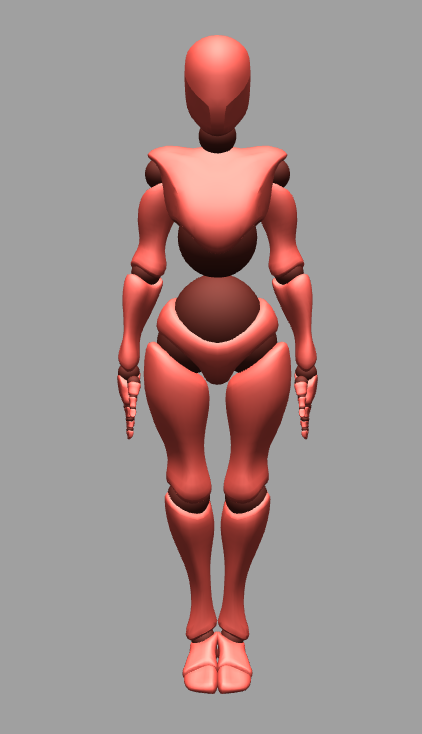
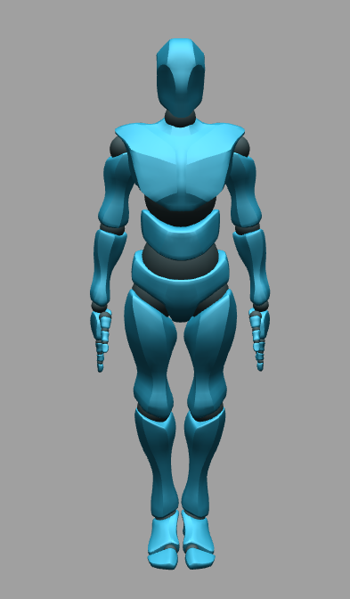

# *CR Documents*
CR language is a programming language designed for virtual robot control.

In this document, you will learn how to write a simple CR program.

# **Basic Structure **
Let's look at an example of simple CR code:
<pre>
MODEL = YBOT;
function exampleFunction(a, b) {
    LHand.raise(a, b); 
}

BEGIN

// This is a comment
Head.rotate(90, 1);

END
</pre>
> In CR language, all the whitespaces(spaces, tabs, enters, etc) are ignored. The code are seperated by a semi colon **;** .

I will explain this code line by line.
  
    
## **Model Declaration**
The first line of code is called model declaration. CR language offers two different kind of robots, XBOT and YBOT
	
XBOT:  YBOT:  

> Every CR program must start with a model declaration, otherwise it will cause an error.

## **Function Declaration**

The next section is called function declaration. You can define a function that has several <a href="#statements"><b>statements</b></a> by yourself. A function declaration can be seperated into several parts:

<pre>function</pre>

 A function declaration should always start with a <b>function</b> keyword, followed by the name of that function.
<pre>exampleFunction</pre>
A function name must start with a letter, and followed by a sequence of letters or numbers. The function name is case-sensitive and it cannot be a <a href="#keyword"><b>keyword</b></a>.

<pre>(a, b)</pre>

You can input parameters to a function. They should be seperated by a comma and enclosed by parentheses. If there are no parameters, you still need to use empty parentheses.

<pre>{ LHand.raise(a, b); }</pre>

The body of a function is several <a href="#statements"><b>statements</b></a> enclosed by curly braces. When this function is called, the code here will be executed in sequence.

In this example, the only statement is a <a href="#pfCall"><b>Primitive Function Call</b></a>.

## **BEGIN and END**

The body of CR codes must start with a <b>BEGIN</b> key word and end with an <b>END</b> key word.
 

## **Body of the program**

The body of the program is between BEGIN and END. The code here will be executed in sequence. In this example, the only statement is a <a href="#pfCall"><b>Primitive Function Call</b></a>
<pre>Head.rotate(90, 1);</pre>

## **Comments**

You may have noticed that there is a line of comment, which start with two slash <pre>//This is a comment</pre> These comments do not have any effects. They are usually used to explain your code.

> You can add a comment anywhere in your code.

 
 
# **Statements **

 There are several types of statement: 

	<ul>
		<li><a href="#assignment">Assignment Call</a></li>
		<li><a href="#fCall">Function Call</a></li>
		<li><a href="#pfCall">Primitive Function Call</a></li>
		<li><a href="#seq">Seq Block</a></li>
		<li><a href="#sim">Sim Block</a></li>
	</ul>
 

## **Assignment Call</h3>**
 

You can assign a real number value to a variable using an assignment call

<pre>a = 10 * 2;</pre>

The left-hand side, <b>a</b>, is the variable name. The variable name must start with a letter, and followed by a sequence of letters or numbers. The function name is case-sensitive and it cannot be a <a href="#keyword"><b>keyword</b></a>. 

The right-hand side should be a math expression. Supported math operations are: <pre>+, -, *, /, mod</pre> 

This example assignment will assign 20 (the result of 10 * 2) to the variable <b>a</b>. You can assign another value to <b>a</b> using the same syntax. 

You can also use variables in another assignment call like

<pre>b = a + 15;</pre>

which assigns value 35 to <b>b.</b>

 You can assign a new value to the same variable using its old value:

<pre>a = a + 5;</pre>

This assignment call calculates the right-hand side expression using the old value of <b>a</b>, which is 20, and assign the new value 25 to <b>a.</b>

 

## **Function Call**
 

This example Function Call calls the previously defined function <b>exampleFunction</b>:

<pre>exampleFunction(45, 2);</pre>

The function call executes the body code of the function, in this example, is a <a href="#pfCall"><b>Primitive Function Call</b></a>

<pre>LHand.raise(a, b);</pre>

However, because we input two values, 45 and 2, into this function, two assignment call is added to the function body before this Primitive Function Call

<pre>a = 45;
b = 2;</pre>

This example Function Call rotates the head for 45 degrees in two seconds.

You can call a function using defined variables as input, for example: 

<pre>a = 45;
b = 2;
exampleFunction(a, b);
</pre>

> 
Notice that when calling a function, the input is the value, not the variable. Any changes made in function call to a variable will not be made to the variable outside that function.

> 
In this case, if the <b>exampleFunction</b> changes the value of <b>a</b> or <b>b</b> in its body, it will not affect the value of a and b outside this Function Call.

> 
Similarly, all variables defined in the function body cannot be used outside that function.

> 
If the function has no input, you still need to use empty parentheses to call it.

## **Primitive Function Call**
 

A Primitive Function Call is a Function Call that controls the robot to perform an action. You cannot declare a Primitive Function Call by yourself. 

Generally, the syntax of a Primitive Function Call is:

<pre>BodyPart.action(degree, duration);</pre>

A <a href="#body"><b>BodyPart</b></a> is a controllable body part of the robot, and an <b><a href="#action">action</b></a> is the action you want this body part to perform.

Most actions that a robot can perform are just rotations of a body part, so the first parameter decides the degree of this rotation. The second parameter decides the time of this action.

The example code

<pre>Head.rotate(90, 1);</pre>

controls the robot to <b>rotate</b> its <b>head</b> for <b>90</b> degrees in <b>one</b> second.

Same as a Function Call, you can use defined variables as input to a Primitive Function Call.

Notice that the <b>dance</b> function's input parameters are different from others:

<pre>Body.dance(speed, duration);</pre>

The first parameter of dance function is the speed of the pre-recorded dance, 1 means the default speed. The second parameter is the time you want your robot to dance.

## **Seq Block**
 

 The syntax of a Seq Block is

<pre>
seq{
	// Statements
	Head.rotate(90, 2);
	Body.dance(1, 10);
};
</pre>

A Seq Block must start with the keyword <b>seq</b>. The body of Seq Block is enclosed by curly braces, like a function declaration.

Same as a function, the body of a Seq Block is executed in sequence. In this example, when the code is executed, the robot will rotate its head for 90 degrees in the first two seconds, then dance in default speed for 10 seconds.

## **Sim Block**
 

The syntax of a Sim Block is

<pre>
sim{
	// Statements
	LArm.raise(90, 1);
	RArm.raise(90, 2);
};
</pre>

A Sim Block must start with the keyword <b>sim</b>. The body of Sim Block is enclosed by curly braces, like a function declaration.

Different with a Seq Block, the body of a Sim Block is executed <b>simultaneously</b>. In this example, when the code is executed, the robot will raise its left arm <b>and</b> right arm together, but in different speed.

The robot will raise its left arm for 90 degrees in 1 second, and its right arm in two seconds. The code after a Sim Block will be executed when the action has the longest duration in the Sim Block is finished.

 

> The changes made to a defined variable will not change the value of that variable outside the Seq or Sim Block, and you cannot use the variables which are defined in the Seq or Sim Block outside that Block.

> You can write any statement in a Seq or Sim Block, even a Sim Block or a Seq Block. 

# **Key Word**

There are some reserved words in CR language. You cannot use the words listed here as a variable name or function name.

## **Common**
<ul>
    <li>MODEL </li>
    <li>XBOT</li>
    <li>YBOT</li>
    <li>BEGIN</li>
    <li>END</li>
    <li>mod</li>
    <li>function</li>
    <li>sim</li>
    <li>seq</li>
</ul>

## **Body Part**
<ul>
    <li>LArm</li>
    <li>RArm</li>
    <li>LForeArm</li>
    <li>RForeArm</li>
    <li>LHand</li>
    <li>RHand</li>
    <li>LLeg</li>
    <li>RLeg</li>
    <li>LUpLeg</li>
    <li>RUpLeg</li>
    <li>LFoot</li>
    <li>RFoot</li>
    <li>Head</li>
    <li>Body</li>
</ul>

## **Action**

 (BodyParts that can perform the action)

<ul>
    <li>raise (LArm, RArm, LForeArm, RForeArm, LLeg, RLeg, LUpLeg, RUpLeg, Head)</li>
    <li>lateralRaise (LArm, RArm, LUpLeg, RUpLeg)</li>
    <li>rotate (Head, Body, LHand, RHand, LFoot, RFoot, LForeArm, RForeArm)</li>
    <li>tilt (Head, Body)</li>
    <li>dance (Body)</li>
    <li>bow (Body)</li>
</ul>
  

